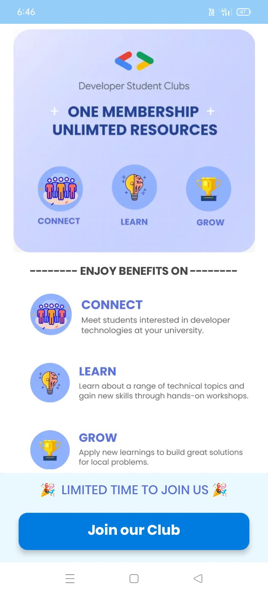

<h1 style="display:inline">  GDSC GMRIT Connect</h1> 
<h3><i>Learn. Code. Grow.</i></h3>

  

 

 &nbsp;
 &nbsp;
 &nbsp;
 &nbsp;
 
  

<h3 align="center">
    🔹
    <a href="https://github.com/saikiran1224/GDSC_GMRIT_App/issues">Report Bug</a> &nbsp; &nbsp;
    🔹
    <a href="https://github.com/saikiran1224/GDSC_GMRIT_App/issues">Request Feature</a>
</h3>

## 😉 TL;DR
If you would like to use this application, fork the repository and link back to [saikiran1224](https://github.com/saikiran1224) for proper credits. Thanks in Advance! 

## 🧠 Motivation behind Developing this Application

To overcome the old traditional way of promoting the events conducted by [**GDSC GMRIT Chapter**](https://gdsc.community.dev/gmr-institute-of-technology-razam/), we thought of promoting in a different and unique way and finally came up with a solution i.e., To develop an app, which will be handy to users, and also helps our community members to become interative with us. With an app, we can easily reach hundreds of students with just a single notification and also helps them to attend events seamlessly with hassle-free experience. 

## GDSC GMRIT Connect

An android application developed specifically for students and community members which helps to interact and get notified about the events. It also helps make the RSVP easier where it directly redirects to the Event Page in the GDSC Community Dev Platform. It also helps the students to know more about our chapter and about Google Developer Student Clubs, and become a member with us. The User Interface is designed in such a way it motivates students and community members.

## 👷🏼 Built With 

This application is initially developed for **Native Android users** and will be extended to iOS Users in coming future. Any Contributors are open if they are willing to contribute.  

This project was built using these technologies.

- Native Android
- Kotlin
- Material Design 
- Firebase
   - Authentication (Email ID & Password)
   - Cloud Firestore
   - Storage
   - Cloud Messaging
   - Analytics
   - Crashlytics
- Lottie Files
- Glide
- Volley

## 🤩 Features

- Create account based on your College, Registration Number(JNTU Number), Year of Study, etc. 
- Image Slider which helps chapters to publicise posters and events in the Home Page
- Seperate sections for both Upcoming and Past Events
- Dedicated activity for each Event Page describing details like Instructor, About, Things you will learn and Prerequisites
- Register Event Button will help you directly redirect to the event platform 
- Notifications are sent from Firebase FCM Console 
- Students and Community Members can submit thier ideas from dedicated page in the app. 
- Students can learn technologies directly from the app (*Coming Soon*)

## 👉 Usage Instructions

Follow the below steps to be able to use this application for your chapter. 

1. Fork this application and clone to your system using the command `https://github.com/[your user name]/GDSC_GMRIT_App.git`
2. Since the application works on Firebase, please create a [Firebase](https://firebase.google.com/) account if you don't have already.
3. Once you get successfully logged in to your Firebase account, click on the **Go to Console** Button on the top right of your screen. 
4. Click on Add Project Button, and enter the package name of the project copying it from `build.gradle` file. 
     
    **Note:** If you wish to change the package name of the project, feel free to use [this](https://stackoverflow.com/questions/16804093/rename-package-in-android-studio) to know detailed steps. 
5. Once you are done adding the details, by clicking on the Next Step Button, you will be asked to download the `google-services.json` file which is responsible for the connection between your app and Firebase account. 
6. Now follow the steps as mentioned, as it suggests to paste this file under `Project Directory >> app > src`. Kindly delete the previous file which is already there and replace it with your newly downloaded file.
7. That's all ! Refer the modal classes in the source code and change your schema accordinly. 

## 👀 Wanna try it out ?

We have created a test user account if you wish to visit our app. Below are the credentials:

| Email ID |  Password |
| --- |  --- | 
| testuser@gmail.com | TestUser123@ |

Kindly use it only for testing purpose. Thanks in Advance !

## 👨‍🔧 Contribute

This project is open for contributors and feel free to `fork` and make a `Pull Request` to the repo. If you feel any enhancements are required don't hesistate to open an issue.

## 👁 Screenshots 

<table>
 
 <tr>
   <td width="33.3%">&nbsp;</td>
   <td width="33.33%">&nbsp;</td>
   <td width="33.33%">&nbsp;</td>
 </tr>
 <tr>
   <td align="center">Onboarding Screen</td>
   <td align="center">Home Page</td>
   <td align="center">Event Details Page</td>
 </tr>
 
 <tr>
   <td width="33.3%">&nbsp;</td>
   <td width="33.33%">&nbsp;</td>
   <td width="33.33%">&nbsp;</td>
 </tr>
 <tr>
   <td align="center">Join our Club Page</td>
   <td align="center">Idea Page</td>
   <td align="center">Student Profile Page</td>
 </tr>
  
</table>

 

## 🧑‍💻 Team behind developing this Project

| Name | Role | LinkedIn |
|---| --- | --- |
|Sai Kiran Kopparthi (myself) | Android Developer | [@saikiran-kopparthi](https://www.linkedin.com/in/sai-kiran-kopparthi-2204a518a/) |
| Yeswanth Choudari | Product Designer| [@yeswanth-choudari](https://www.linkedin.com/in/choudari-yeswanth-4b27451a7/) |

## ❣️ Show your support 

Follow me for more projects and dont forget to Give a ⭐ if you like this application!

## Become a member of our Club

[**Click here to join us!**](https://gdsc.community.dev/gmr-institute-of-technology-razam/)

## 🔑 LICENSE 

This project has MIT License. Refer to [LICENSE.md]([./LICENSE.md](https://github.com/saikiran1224/GDSC_GMRIT_App/blob/master/LICENSE.md)) for more details